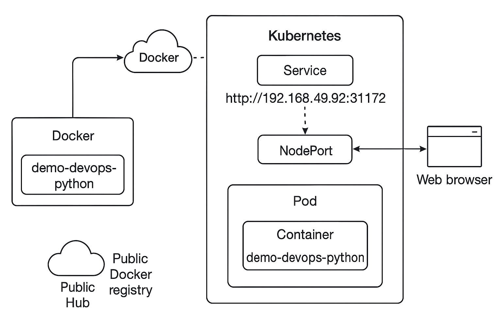

# Demo Devops Python

This is a simple application to be used in the technical test of DevOps. The goal is to containerize, deploy, and expose the service using Docker and Kubernetes.

## Stack

- Python 3.11.3
- Django
- Docker
- Docker Hub
- Kubernetes (Minikube)
- kubectl

## Getting Started

### Prerequisites

- Python 3.11.3

### Installation

Clone this repo.

```bash
git clone https://bitbucket.org/devsu/demo-devops-python.git
```

Install dependencies.

```bash
pip install -r requirements.txt
```

Migrate database

```bash
py manage.py makemigrations
py manage.py migrate
```

### Database

The database is generated as a file in the main path when the project is first run, and its name is `db.sqlite3`.

Consider giving access permissions to the file for proper functioning.

## Usage

To run tests you can use this command.

```bash
py manage.py test
```

To run locally the project you can use this command.

```bash
py manage.py runserver
```

Open http://localhost:8000/api/ with your browser to see the result.

### Features

These services can perform,

#### Create User

To create a user, the endpoint **/api/users/** must be consumed with the following parameters:

```bash
  Method: POST
```

```json
{
    "dni": "dni",
    "name": "name"
}
```

If the response is successful, the service will return an HTTP Status 200 and a message with the following structure:

```json
{
    "id": 1,
    "dni": "dni",
    "name": "name"
}
```

If the response is unsuccessful, we will receive status 400 and the following message:

```json
{
    "detail": "error"
}
```

#### Get Users

To get all users, the endpoint **/api/users** must be consumed with the following parameters:

```bash
  Method: GET
```

If the response is successful, the service will return an HTTP Status 200 and a message with the following structure:

```json
[
    {
        "id": 1,
        "dni": "dni",
        "name": "name"
    }
]
```

#### Get User

To get an user, the endpoint **/api/users/<id>** must be consumed with the following parameters:

```bash
  Method: GET
```

If the response is successful, the service will return an HTTP Status 200 and a message with the following structure:

```json
{
    "id": 1,
    "dni": "dni",
    "name": "name"
}
```

If the user id does not exist, we will receive status 404 and the following message:

```json
{
    "detail": "Not found."
}
```
## Deployment Overview



> This app is built and published to Docker Hub and deployed using Kubernetes in a local Minikube cluster.

## Setup Instructions

### Local Setup

```bash
git clone https://bitbucket.org/devsu/demo-devops-python.git
cd demo-devops-python
pip install -r requirements.txt
py manage.py migrate
py manage.py runserver
```

Visit: [http://localhost:8000/api/](http://localhost:8000/api/)

---

## Run Tests

```bash
py manage.py test
```

---

## Docker Image

Build and run locally:

```bash
docker build -t yada05/demo-devops-python .
docker run -p 8005:8000 yada05/demo-devops-python
```

Image available at:  
https://hub.docker.com/r/yada05/demo-devops-python

---

## Kubernetes Deployment

### 1. Start Minikube and connect to Docker daemon

```bash
minikube start
minikube -p minikube docker-env --shell powershell | Invoke-Expression
```

### 2. Apply Kubernetes resources

```bash
kubectl apply -f deployment.yaml
kubectl apply -f service.yaml
```

### 3. Expose the API

```bash
minikube service demo-python-service
```

Expected URL example:  
`http://192.168.49.2:31172/api/`

---

## Kubernetes Resources

### deployment.yaml

```yaml
apiVersion: apps/v1
kind: Deployment
metadata:
  name: demo-python
spec:
  replicas: 2
  selector:
    matchLabels:
      app: demo-python
  template:
    metadata:
      labels:
        app: demo-python
    spec:
      containers:
      - name: demo-python
        image: yada05/demo-devops-python
        ports:
        - containerPort: 8000
```

### service.yaml

```yaml
apiVersion: v1
kind: Service
metadata:
  name: demo-python-service
spec:
  type: NodePort
  selector:
    app: demo-python
  ports:
  - port: 80
    targetPort: 8000
    nodePort: 31172
```

---

## Directory Structure

```
.
├── demo/                  # Django project
├── api/                   # Django app
├── Dockerfile             # Docker build file
├── deployment.yaml        # Kubernetes Deployment
├── service.yaml           # Kubernetes Service
├── requirements.txt
├── README.md
└── docs/
    └── k8s_architecture.png
```

---

## Decision Rationale

- Used `NodePort` service type for local testing with Minikube.
- Docker image uploaded to Docker Hub under `yada05`.
- The base URL is intentionally empty since this is an API-only service.
- Kubernetes manifests are separated and reusable.
- No CI/CD pipeline was required, but the structure allows it.

---

## Extras

- Public Docker image
- Working Kubernetes deployment
- Full documentation with architecture diagram
- Functional and tested Django API


## License

Copyright © 2023 Devsu. All rights reserved.
